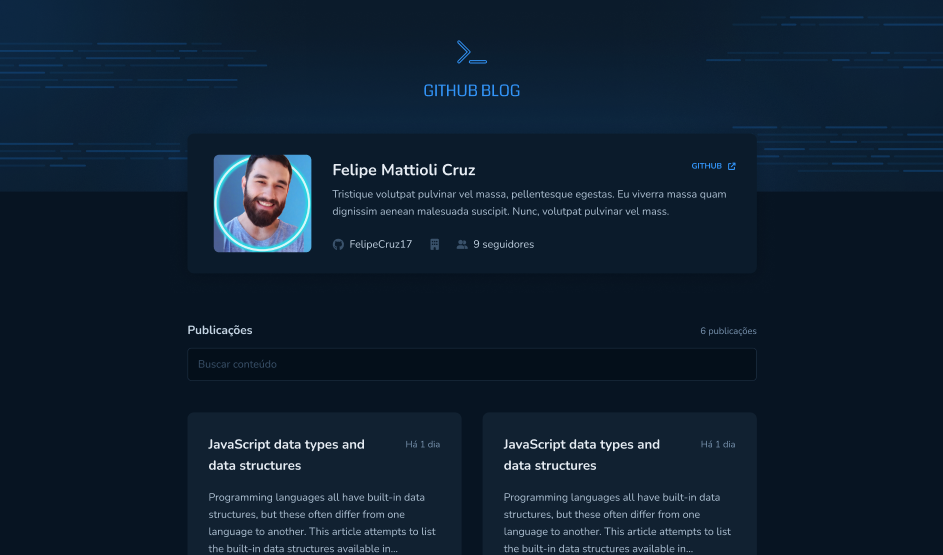

## Projeto Github Blog

Durante este desafio, desenvolvemos uma aplicação que utiliza a API do GitHub para buscar issues de um repositório, dados do perfil e exibir elas como um blog.

### 🛠️ Nesse projeto foi utilizado

* Vite
* Styled Components
* Typescript
* React Router Dom
* React Hook Form
* Axios
* API do Github

## 🚀 Como executar

**Para que esse projeto funcione corretamente, é preciso estar com o servidor rodando.**

- Instale os pacotes com `npm install ou yarn`.
- Execute `npm run dev ou yarn dev` para iniciar o cliente web.
- É necessário preencher as informações de `.env` para que possa trazer as informações do seu próprio Github

## 🖼 Imagens do projeto:
